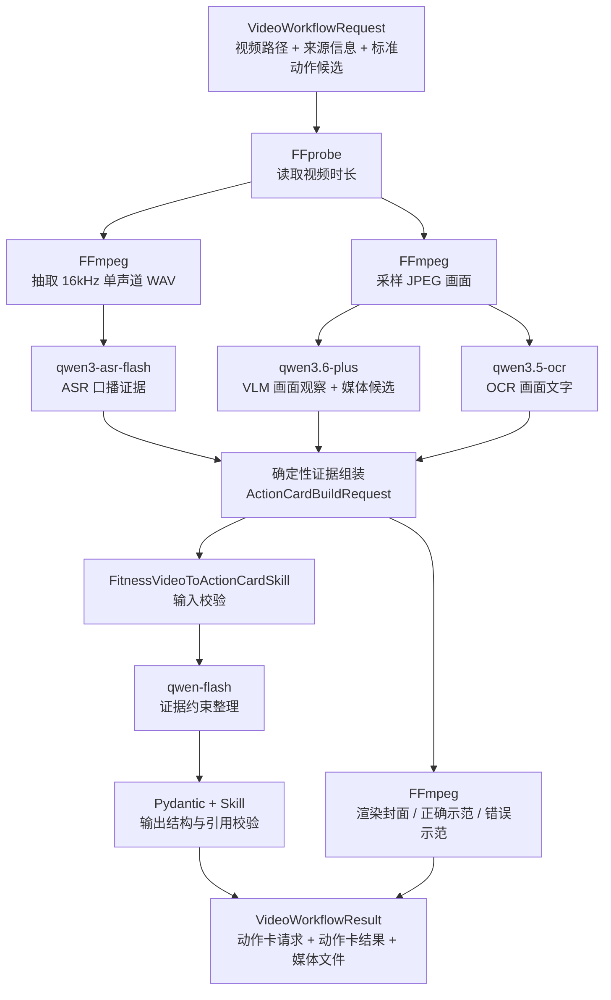

# GoFit 视频到动作卡技术实现详解

## 1. 文档目的

本文说明 GoFit 当前代码如何完成下面这条链路：

```text
视频 → FFmpeg → ASR + OCR + VLM → 证据整理 → qwen-flash → 动作卡
```

这里描述的是仓库当前已经实现的 P0 Demo，而不是未来设想。当前 Demo 的标准动作已经由产品侧人工确认成“哑铃侧平举”；模型负责从视频中提取内容、定位片段并整理卡片，不负责自由决定动作身份。

核心设计原则是：**模型负责理解和归纳，代码负责身份、时间、引用和结构的确定性约束。**

这条链路没有把整段视频直接交给一个大模型。它先把视频拆成音频和采样画面，通过三个模型得到三类带时间轴的证据，再由 Python 代码统一成一个严格的数据契约，最后交给文本模型生成动作卡，并由 Skill 再次验证模型输出。

## 2. 总体架构



主要代码位置：

- 工作流编排：[`backend/ai/app/workflows/fitness_video_reconstruction.py`](../../backend/ai/app/workflows/fitness_video_reconstruction.py)
- FFmpeg 媒体处理：[`backend/ai/app/media/ffmpeg.py`](../../backend/ai/app/media/ffmpeg.py)
- ASR Provider：[`backend/ai/app/providers/dashscope_asr.py`](../../backend/ai/app/providers/dashscope_asr.py)
- OCR、VLM、动作卡模型 Provider：[`backend/ai/app/providers/openai_compatible.py`](../../backend/ai/app/providers/openai_compatible.py)
- 证据和输出数据模型：[`backend/ai/app/models/action_card.py`](../../backend/ai/app/models/action_card.py)
- 视频工作流数据模型：[`backend/ai/app/models/video_workflow.py`](../../backend/ai/app/models/video_workflow.py)
- 动作卡 Skill：[`backend/ai/app/skills/fitness_video_to_action_card.py`](../../backend/ai/app/skills/fitness_video_to_action_card.py)
- 异步任务接口：[`backend/ai/app/api/routes/action_card_jobs.py`](../../backend/ai/app/api/routes/action_card_jobs.py)

## 3. 输入：VideoWorkflowRequest

完整视频流程的入口不是裸视频文件，而是一个 `VideoWorkflowRequest`：

```json
{
  "requestId": "video_job_001",
  "sourceVideo": {
    "videoId": "video_demo_001",
    "title": "哑铃侧平举教学 Demo",
    "creatorName": "GoFit Demo Coach",
    "sourceUrl": "https://example.test/videos/demo"
  },
  "videoPath": "../../飞书20260721-193601.mp4"
}
```

字段职责：

- `requestId`：贯穿任务、错误和生成目录的幂等标识。
- `sourceVideo`：动作卡最终必须保留的来源视频信息。
- `videoPath`：AI 服务本机可以读取的视频路径。
- `standardActionCandidates`：允许输出的标准动作候选。Demo 请求可以省略该字段。

### 3.1 为什么 Demo 请求可以不传标准动作

`VideoWorkflowRequest` 的默认工厂会注入唯一候选：

```json
{
  "standardActionId": "action_lateral_raise",
  "name": "哑铃侧平举",
  "aliases": ["侧平举", "站姿哑铃侧平举"],
  "bodyRegion": "肩部",
  "primaryMuscles": ["三角肌中束"],
  "secondaryMuscles": ["三角肌前束"],
  "equipment": ["哑铃"]
}
```

这表示产品已经知道当前 Demo 是什么动作。VLM 可以描述视频里的身体姿态，但不能把动作身份改成其他动作。这样做把“动作库主数据”留在业务规则中，而不是让生成模型随意产生动作名称、肌群或器械。

如果未来支持任意视频，应该由动作检索或业务后端提供候选列表；不能继续给所有视频默认注入侧平举。

## 4. 阶段一：FFmpeg 将视频转为模型可消费的材料

模型输入需要稳定、统一的小文件，因此工作流先调用 FFprobe 和 FFmpeg。

### 4.1 读取视频时长

FFprobe 命令的等价形式为：

```text
ffprobe -v error -show_entries format=duration -of json <video>
```

程序把秒数转换为毫秒。后续所有 ASR、OCR、VLM 和媒体候选的时间都必须落在 `0 ~ durationMs` 内。

视频时长不是只用于展示，它是整个时间轴的边界。模型返回超过边界的时间会被工作流拒绝。

### 4.2 抽取音频

FFmpeg 等价参数为：

```text
ffmpeg -y -i <video> -vn -ac 1 -ar 16000 -c:a pcm_s16le audio.wav
```

含义：

- `-vn`：去掉视频流，只保留音频。
- `-ac 1`：转成单声道。
- `-ar 16000`：统一成 16 kHz 采样率。
- `pcm_s16le`：输出未压缩的 16-bit PCM WAV。

统一音频格式可以减少 ASR 对原始封装格式、声道和采样率的差异处理。

### 4.3 采样画面

当前实现使用：

```text
ffmpeg -i <video> -vf fps=1/<interval>,scale=768:-2 -frames:v <maxFrames> frame_%04d.jpg
```

默认配置：

- `GOFIT_FRAME_INTERVAL_SECONDS=2.0`
- `GOFIT_MAX_FRAMES=24`
- 图片宽度缩放到 768 像素，高度保持比例并调整为偶数。

每张图片会在 Python 中对应一个 `FrameSample(path, timestampMs)`。例如默认配置产生的时间是 `0ms、2000ms、4000ms...`。

### 4.4 临时文件和持久文件的区别

抽取出的 WAV 和采样 JPEG 放在 `TemporaryDirectory`，模型处理完成后自动删除。

真正给前端使用的封面和示范片段会写入：

```text
GOFIT_MEDIA_OUTPUT_DIR/<safeRequestId>/
```

默认目录是仓库的 `storage/ai-generated`。

## 5. 阶段二：ASR、OCR、VLM 产生三种互补证据

“ASR + OCR + VLM”表示三种证据来源，它们解决的问题不同：

| 模型 | 当前模型名 | 输入 | 主要输出 | 解决的问题 |
|---|---|---|---|---|
| ASR | `qwen3-asr-flash` | 完整 WAV 音频 | 带起止时间的口播文本 | 教练说了什么 |
| OCR | `qwen3.5-ocr` | 采样 JPEG | 指定采样时刻的可见文字 | 画面字幕、标签写了什么 |
| VLM | `qwen3.6-plus` | 采样 JPEG + 时间标签 | 姿态观察和媒体候选区间 | 人在做什么、哪些区间可作示范 |

它们使用同一个 `DASHSCOPE_API_KEY`，但接口路径不同：

- OCR、VLM、`qwen-flash`：`{DASHSCOPE_BASE_URL}/compatible-mode/v1/chat/completions`
- ASR：`{DASHSCOPE_BASE_URL}/api/v1/services/aigc/multimodal-generation/generation`

### 5.1 ASR：把完整音轨变成口播时间段

`DashScopeAsrProvider` 读取 WAV，进行 Base64 编码，然后以 Data URI 放入 DashScope 原生多模态请求：

```json
{
  "model": "qwen3-asr-flash",
  "input": {
    "messages": [{
      "role": "user",
      "content": [{"audio": "data:audio/wav;base64,..."}]
    }]
  },
  "parameters": {
    "asr_options": {
      "enable_itn": false,
      "language": "zh"
    }
  }
}
```

Provider 会递归寻找带 `start_time/begin_time`、`end_time` 和 `text` 的结果，转换为：

```json
{
  "startMs": 8000,
  "endMs": 15000,
  "text": "肘部微屈，用肘部带动手臂向两侧抬起。",
  "confidence": 0.98
}
```

处理规则：

- 超过视频时长的结束时间会截断到 `durationMs`。
- 空文本、负开始时间、结束时间不晚于开始时间的条目会丢弃。
- 重复的 `(startMs, endMs, text)` 会去重并按时间排序。
- 如果接口只返回整段文本而没有时间片，会退化成覆盖整个视频的一条证据。
- 完全没有可用文本时返回 `NO_SPEECH_EVIDENCE`。

### 5.2 VLM：理解动作阶段并提出媒体候选

VLM 请求把每张采样图像编码为 Base64，同时在图像前明确写入采样时间：

```text
时间 8000ms 的采样画面：<image>
时间 10000ms 的采样画面：<image>
```

图片使用 OpenAI 兼容的 `image_url` Data URI，VLM 使用 `detail: low`。请求温度为 `0`，并在启用配置时要求 `json_object` 输出。

VLM 被要求只描述画面可见事实，不补充健身常识。输出分成两部分：

```json
{
  "observations": [
    {
      "observationId": "raise_phase",
      "startMs": 8000,
      "endMs": 15000,
      "description": "双臂从身体两侧向外抬起，在肩部高度附近停止。",
      "onScreenText": null,
      "confidence": 0.96
    }
  ],
  "mediaProposals": [
    {
      "candidateId": "correct_raise",
      "kind": "CORRECT_DEMO",
      "startMs": 8000,
      "endMs": 21000,
      "observationIds": ["raise_phase", "lower_phase"]
    }
  ]
}
```

三种媒体候选含义：

- `POSTER`：适合作为封面的单帧位置。
- `CORRECT_DEMO`：可以循环播放的正确动作区间。
- `ERROR_DEMO`：视频明确展示错误动作的区间。

VLM 只有在画面明确展示错误时才允许提出 `ERROR_DEMO`。没有错误演示，就不能仅凭常识创造一个“常见错误片段”。

### 5.3 OCR：只读取真实可见文字

OCR 和 VLM 使用相同的采样图，但职责更窄：

- 不推测动作名称。
- 不补充画面中没有的内容。
- 只返回确实含文字的画面。
- `timestampMs` 必须原样使用输入给出的采样时间。

OCR 使用 `detail: high`，输出形如：

```json
{
  "observations": [
    {
      "timestampMs": 10000,
      "text": "肩膀下沉，肘部带动",
      "confidence": 0.95
    }
  ]
}
```

代码会检查每个 OCR 时间是否真的属于输入帧。如果模型返回一个不存在的时间戳，整个 OCR 结果会以 `OCR_ANALYSIS_INVALID` 被拒绝。

### 5.4 当前三路调用的执行顺序

从逻辑上看三者是并列证据源，但当前代码并没有并发调用。实际顺序是：

```text
抽音频 → ASR → 抽帧 → VLM → OCR
```

这样实现简单、容易定位错误，但总体耗时是三次模型耗时之和。未来可以在音频和图片准备好后并行执行 ASR、VLM、OCR。

## 6. 阶段三：确定性代码整理证据

这是整条链路里最关键、也最容易被误解的一步。

当前实现**没有再调用一个 LLM 把 ASR、OCR、VLM 整理成 Skill 输入**。整理工作由 `FitnessVideoReconstructionWorkflow._assemble_action_card_request()` 完成，是确定性的 Python 转换。

最终生成的中间契约叫 `ActionCardBuildRequest`：

```json
{
  "requestId": "video_job_001",
  "sourceVideo": {...},
  "standardActionCandidates": [...],
  "evidence": [...],
  "mediaCandidates": [...]
}
```

### 6.1 ASR 证据 ID

每个口播分段按时间顺序编号：

```text
asr_001
asr_002
asr_003
```

并转换为统一的 `TimedEvidence`：

```json
{
  "evidenceId": "asr_002",
  "kind": "ASR",
  "startMs": 8000,
  "endMs": 15000,
  "text": "肘部微屈，用肘部带动手臂向两侧抬起。",
  "confidence": 0.98
}
```

### 6.2 VLM 证据 ID

VLM 的 `observationId` 会先清理非法字符，再加上 `vision_` 前缀：

```text
raise_phase → vision_raise_phase
```

代码拒绝重复的观察编号、重复的证据 ID，以及超过视频范围的观察区间。

### 6.3 OCR 证据 ID

独立 OCR 结果按顺序生成：

```text
ocr_001
ocr_002
```

每条 OCR 证据当前被视为从采样时间开始、最长持续 1000ms：

```text
startMs = timestampMs
endMs   = min(durationMs, timestampMs + 1000)
```

如果独立 OCR 没有返回任何观察，工作流才会使用 VLM observation 中的 `onScreenText` 作为 OCR 兜底证据。这样可以避免 VLM 和 OCR 对同一画面文字重复记账。

### 6.4 媒体候选如何绑定证据

VLM 的媒体候选引用的是 `observationIds`，而动作卡 Skill 只接受统一的 `evidenceIds`。工作流负责完成映射：

```text
mediaProposal.observationIds
        ↓ observation_evidence 映射
MediaCandidate.evidenceIds
```

例如：

```json
{
  "candidateId": "correct_raise",
  "kind": "CORRECT_DEMO",
  "startMs": 8000,
  "endMs": 21000,
  "evidenceIds": ["vision_raise_phase", "vision_lower_phase"]
}
```

以下情况会直接失败：

- 候选区间超出视频时间。
- 候选引用不存在的 observation。
- 两个候选使用相同 `candidateId`。
- 候选最终没有绑定任何有效证据。
- 所有候选中没有 `CORRECT_DEMO`。

最后，三类证据会按 `(startMs, endMs, evidenceId)` 排序，形成稳定、可测试的 Skill 输入。

## 7. 阶段四：根据媒体候选精确裁剪文件

证据组装完成后，工作流先把媒体候选渲染成实际文件。

### 7.1 封面

`POSTER` 候选在 `startMs` 位置截取一张 JPEG：

```text
ffmpeg -i <video> -ss <startSeconds> -frames:v 1 <candidateId>.jpg
```

### 7.2 正确与错误示范

`CORRECT_DEMO` 和 `ERROR_DEMO` 会裁剪为静音 MP4：

```text
ffmpeg -i <video> -ss <startSeconds> -t <durationSeconds> \
  -an -c:v libx264 -pix_fmt yuv420p -movflags +faststart <candidateId>.mp4
```

这样做有两个目的：

- 卡片引用的是已经落盘、时间范围确定的素材，不需要前端再次裁剪原视频。
- `candidateId`、时间范围和 `evidenceIds` 同时保留，便于审计为什么选了这段画面。

## 8. 阶段五：FitnessVideoToActionCardSkill 调用 qwen-flash

### 8.1 Skill 到底是什么

这里的 Skill 不是一个模型，也不是单独的 Prompt 文件。它是一个稳定的业务能力边界：

```text
ActionCardBuildRequest
  → 输入校验
  → ActionCardGenerator.generate()
  → qwen-flash
  → Pydantic 解析
  → 业务不变量校验
  → ActionCardBuildResult
```

Skill 的价值是把“模型可能怎么回答”限制成“产品能够安全接收什么”。即使以后替换模型，Skill 的输入输出契约和验证规则仍然可以保留。

### 8.2 调用 qwen-flash 前的输入校验

Skill 会先拒绝：

- 没有任何证据。
- 没有标准动作候选。
- 证据时间范围无效。
- 媒体候选引用不存在的证据 ID。

这意味着明显错误的数据不会浪费一次模型调用。

### 8.3 qwen-flash 的任务

`qwen-flash` 不再看视频和图片。它收到的是完整 `ActionCardBuildRequest` JSON 和动作卡 JSON Schema。

Prompt 的核心约束是：

- 只能使用当前视频证据，不补充通用健身常识。
- 不读取评论或练友经验。
- 唯一标准动作已经人工确认时，不再识别或选择动作。
- 输出学习正面 `learningSide` 和训练速记背面 `trainingSide`。
- 正反面使用同一段 `CORRECT_DEMO`。
- 生成 3～5 个步骤。
- 关键提醒最多 2 条。
- 训练速记提示最多 3 条。
- 只有存在 `ERROR_DEMO` 才能生成 `commonErrors`。
- 所有文字和媒体都必须引用输入中的 `evidenceId`。
- 证据不足时输出 `NEEDS_REVIEW`，不能猜测。
- 严格返回 JSON，不返回 Markdown。

请求使用 `temperature: 0`，并在配置允许时设置：

```json
{"response_format": {"type": "json_object"}}
```

### 8.4 为什么 qwen-flash 之后还要覆盖动作身份

即使 Prompt 已经告诉模型唯一标准动作，代码仍不会完全相信生成结果。

当输入只有一个候选时，Provider 会在模型返回后强制写入：

```json
{
  "standardAction": {
    "standardActionId": "action_lateral_raise",
    "confidence": 1.0,
    "decision": "MATCHED"
  }
}
```

同时强制覆盖动作卡中的：

- `sourceVideo`
- `actionName`
- `bodyRegion`
- `primaryMuscles`
- `secondaryMuscles`
- `equipment`

因此模型即使生成了其他动作名，也无法改变 Demo 的动作身份。

## 9. 阶段六：模型输出后的强校验

模型返回 JSON 后，需要经过两层验证。

### 9.1 Pydantic 结构验证

`ActionCardBuildResult` 使用 `extra="forbid"`，不接受 Schema 之外的额外字段。主要结构包括：

```text
ActionCardBuildResult
├── schemaVersion
├── requestId
├── status: READY | NEEDS_REVIEW | FAILED
├── standardAction
├── actionCard
│   ├── sourceVideo
│   ├── 动作身份字段
│   ├── learningSide
│   │   ├── correctDemo
│   │   ├── steps: 3..5
│   │   ├── keyReminders: 0..2
│   │   └── commonErrors
│   └── trainingSide
│       ├── loopDemo
│       ├── quickCue
│       └── quickTips: 0..3
├── warnings
├── needsReviewReasons
└── provider
```

字段缺失、类型错误、步骤数量不合法或时间范围错误都会导致 `OUTPUT_VALIDATION_FAILED`。

### 9.2 Skill 业务不变量验证

Pydantic 只知道结构，Skill 继续验证跨字段关系：

1. 输出 `requestId` 必须等于输入。
2. 输出 `sourceVideo` 必须等于输入。
3. 标准动作必须来自候选列表。
4. 动作名称、部位、肌群和器械必须与候选完全一致。
5. `READY` 卡片的正反面都必须有示范片段。
6. 正反面示范必须都是 `CORRECT_DEMO`，而且是完全相同的一段。
7. 输出引用的每个 `evidenceId` 都必须真实存在于输入。
8. 输出选择的媒体必须来自输入候选，类型、起止时间和证据集合都必须一致。
9. 每个常见错误必须使用 `ERROR_DEMO`。
10. 常见错误的证据必须是该错误片段证据的子集。

这些校验把模型幻觉从“错误卡片”转换成“明确失败”，而不是让错误数据进入业务后端。

## 10. 最终输出

完整工作流返回 `VideoWorkflowResult`，包含三部分：

```json
{
  "requestId": "video_job_001",
  "actionCardRequest": {
    "evidence": [],
    "mediaCandidates": []
  },
  "actionCardResult": {
    "status": "READY",
    "actionCard": {}
  },
  "mediaArtifacts": [
    {
      "candidateId": "correct_raise",
      "kind": "CORRECT_DEMO",
      "filePath": ".../correct_raise.mp4",
      "startMs": 8000,
      "endMs": 21000
    }
  ]
}
```

- `actionCardRequest`：三路模型证据经过代码整理后的中间产物，也是排错时最重要的数据。
- `actionCardResult`：`qwen-flash` 生成并经 Skill 验证的双面卡片。
- `mediaArtifacts`：FFmpeg 真正输出的封面和视频片段路径。

保留 `actionCardRequest` 的意义是可追溯：看到卡片上的一句话，可以沿 `evidenceIds` 找到是哪条 ASR、OCR 或 VLM 证据支持它。

## 11. 任务接口与进度

模型处理耗时较长，业务后端不应等待一个同步 HTTP 请求。当前 AI 服务提供内存异步任务：

```text
POST /internal/v1/action-card-jobs
GET  /internal/v1/action-card-jobs/{jobId}
```

`POST` 返回 HTTP 202，并通过 FastAPI `BackgroundTasks` 执行工作流。同一个 `requestId` 重复提交时复用已有任务，不会再次执行，并返回响应头：

```text
X-GoFit-Idempotent-Replay: true
```

进度阶段：

| stage | progress | 含义 |
|---|---:|---|
| `QUEUED` | 0 | 任务已创建 |
| `UNDERSTANDING_VIDEO` | 5 / 10 | FFmpeg、ASR、VLM、OCR |
| `LOCATING_CLIPS` | 65 | FFmpeg 渲染媒体候选 |
| `BUILDING_CARD` | 85 | Skill 调用 qwen-flash |
| `COMPLETED` | 100 | 动作卡生成完成 |
| `FAILED` | 保留当时进度 | 返回安全错误信息 |

当前任务只保存在进程内存中。服务重启后任务状态会丢失，也不支持多进程共享，适合本地 Hackathon Demo，不适合直接作为生产任务队列。

## 12. 配置如何映射到代码

日常需要的 `.env` 配置：

```dotenv
DASHSCOPE_API_KEY=你的新 API Key
DASHSCOPE_BASE_URL=https://dashscope.aliyuncs.com

GOFIT_ASR_MODEL=qwen3-asr-flash
GOFIT_OCR_MODEL=qwen3.5-ocr
GOFIT_VISION_MODEL=qwen3.6-plus
GOFIT_ACTION_CARD_MODEL=qwen-flash
GOFIT_ACTION_CARD_PROVIDER=dashscope

GOFIT_FFMPEG_PATH=D:\Tools\ffmpeg\ffmpeg-8.1.1-essentials_build\bin\ffmpeg.exe
GOFIT_FFPROBE_PATH=D:\Tools\ffmpeg\ffmpeg-8.1.1-essentials_build\bin\ffprobe.exe
GOFIT_MEDIA_OUTPUT_DIR=../../storage/ai-generated
GOFIT_FRAME_INTERVAL_SECONDS=2.0
GOFIT_MAX_FRAMES=24
GOFIT_MODEL_TIMEOUT_SECONDS=120
GOFIT_USE_JSON_RESPONSE_FORMAT=true
```

代码从统一根地址自动派生：

```text
DASHSCOPE_COMPATIBLE_BASE_URL
  = DASHSCOPE_BASE_URL + /compatible-mode/v1

DASHSCOPE_NATIVE_BASE_URL
  = DASHSCOPE_BASE_URL + /api/v1
```

## 13. 用“哑铃侧平举”理解证据如何变成卡片

假设三路模型得到这些内容：

```text
ASR  03s–07s  双手持哑铃，手臂放在身体两侧
VLM  03s–07s  人物站立，双手持哑铃，手臂自然下垂
ASR  08s–15s  肘部微屈，用肘部带动向两侧抬起
VLM  08s–15s  双臂抬到肩部高度附近
ASR  16s–21s  控制速度，缓慢下放
ASR  22s–27s  不要为了抬高而耸肩
VLM  22s–27s  对比展示耸肩错误和肩膀下沉
```

代码先转换成：

```text
asr_001, vision_setup
asr_002, vision_raise
asr_003
asr_004, vision_error
```

VLM 同时提出：

```text
correct_raise = 08s–21s, CORRECT_DEMO
error_shrug   = 22s–27s, ERROR_DEMO
```

`qwen-flash` 再把这些证据压缩成：

```text
学习正面
1. 自然站稳，双手持哑铃
2. 肘部微屈，由肘部带动抬起
3. 抬到接近肩高
4. 控制速度缓慢下放

关键提醒
- 不要耸肩
- 下放保持控制

训练背面
肩放松 → 肘带动 → 缓慢落
```

每一步和提醒都携带 `evidenceIds`。所以这不是一个脱离视频自由生成的健身知识卡，而是一张可以回到原视频时间轴核验的证据卡。

## 14. 当前已验证的范围

截至当前代码状态：

- Python 全量测试：52 个通过。
- Uvicorn 可正常启动。
- 健康检查和 OpenAPI 可访问。
- 固定样例动作卡通过 HTTP 和 CLI 两种调用。
- 固定样例输出与期望 JSON 完全一致。
- 示例视频可被 FFprobe 读取，时长约 93.7 秒。
- FFmpeg 成功抽取约 3 MB 的 WAV。
- FFmpeg 成功抽取 24 张非空 JPEG。
- 推荐和练友经验接口的离线路径通过。

真实 DashScope 模型链路尚未在当前 Key 下执行。原因是原 API Key 已经暴露，必须先撤销并换成新 Key。

## 15. 当前限制和下一步改进

### 15.1 采样没有覆盖完整长视频

当前 `fps=1/2 + maxFrames=24` 对 93.7 秒视频只产生：

```text
0s, 2s, 4s, ... 46s
```

后半段没有进入 OCR 和 VLM。这与 Prompt 中“等间隔采样完整视频”的语义不完全一致。

建议改成：先用 FFprobe 得到总时长，再计算最多 24 个覆盖 `0 ~ duration` 的采样点，并按每个明确时间点截图。这样短视频保持足够密度，长视频也不会丢掉后半段。

### 15.2 三个模型当前顺序执行

ASR、VLM、OCR 可以并行，但当前依次调用。真实链路的总耗时可能较长。下一步可以使用线程池或异步 HTTP 并发，同时保留独立错误码。

### 15.3 ASR 把完整 WAV Base64 放入一个同步请求

对于当前约 94 秒 Demo 尚可，但更长或更大的视频会增加内存、请求体和超时风险。生产方案应根据 DashScope 限制切换到对象存储 URL、异步任务或长音频接口。

### 15.4 临时目录默认使用系统盘

`TemporaryDirectory` 当前未指定目录，在 Windows 上通常使用 C 盘。当前机器 C 盘空间很少，真实视频处理可能失败。建议新增 `GOFIT_TEMP_DIR` 并指向 D 盘。

### 15.5 异步任务是进程内状态

服务重启会丢任务；多 Worker 下每个进程看到的任务也不同。生产环境应替换为数据库状态和独立任务队列。

### 15.6 健康接口的 Provider 展示不准确

当前健康接口固定返回 `fixed-fixture`，没有读取真实 `.env`。这不影响模型调用，但会误导排错。应该返回实际动作卡 Provider，并增加 FFmpeg 和模型配置的就绪状态。

### 15.7 需要更细粒度的降级策略

当前 ASR 无结果会直接失败。更完整的产品逻辑可以考虑：

- ASR 失败但 OCR + VLM 足够时，生成 `NEEDS_REVIEW` 卡片。
- OCR 为空时继续依靠 ASR + VLM。
- 没有 `ERROR_DEMO` 时允许生成无“常见错误”的卡片。
- 没有可靠 `CORRECT_DEMO` 时必须停止，不能猜一段视频作为循环示范。

## 16. 一句话总结

当前实现的本质是：**FFmpeg 负责把视频变成标准媒体材料，ASR/OCR/VLM 负责产生带时间的事实证据，Python 工作流负责确定性对齐和引用，qwen-flash 负责把事实压缩成产品文案，Skill 负责阻止模型越权和幻觉，Pydantic 负责保证最终 JSON 可以被业务系统安全消费。**
